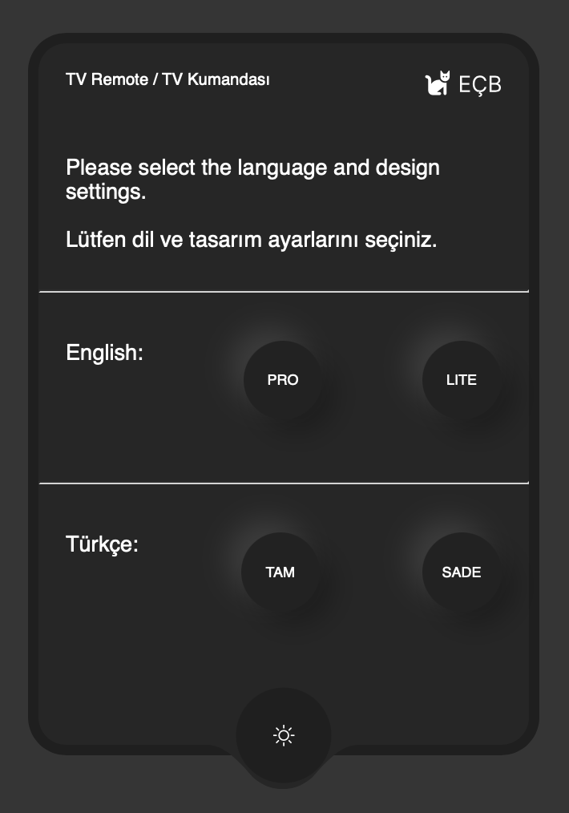
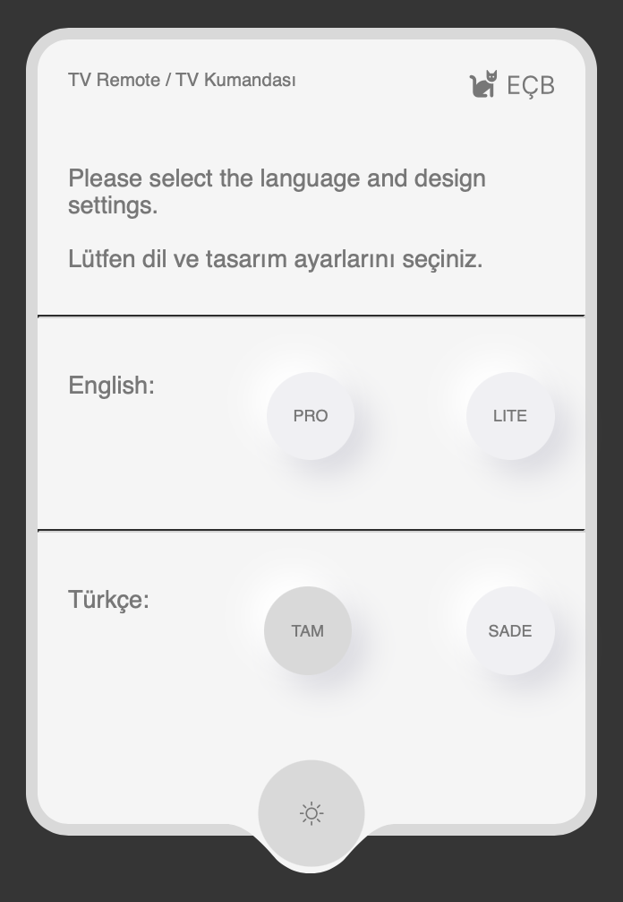
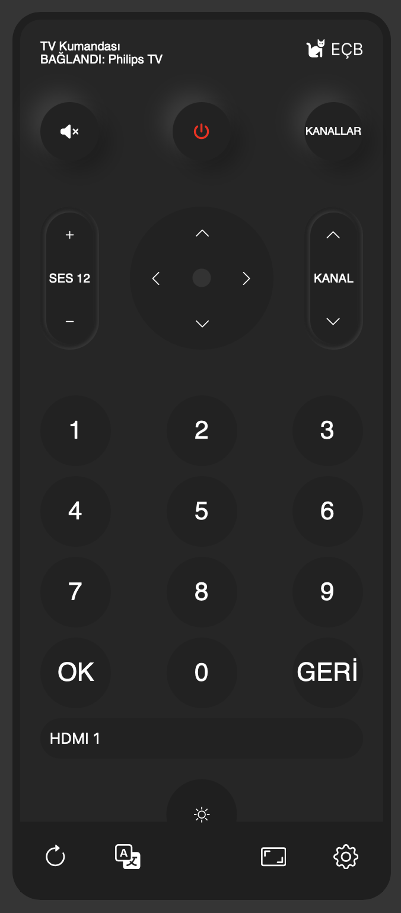
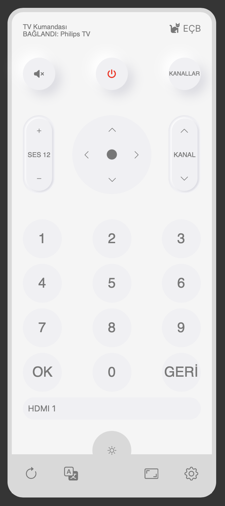
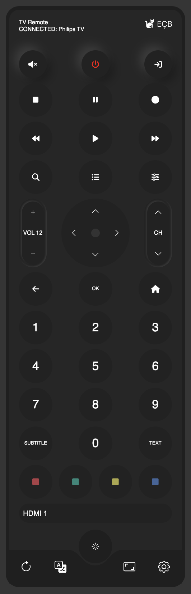
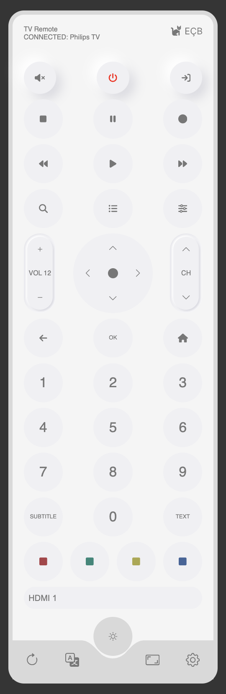
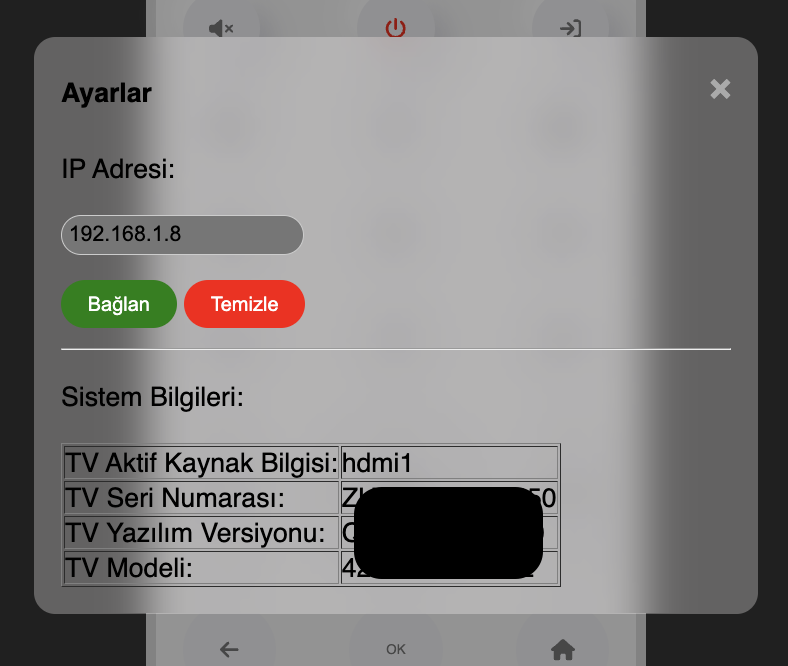

# TV Remote Control in JavaScript / TV Uzaktan Kumandası

## English
### Overview
This project is a simple JavaScript-based TV remote control that sends requests to a television's API using its IP address. It operates purely on front-end JavaScript.

### Features
- Send HTTP requests to the TV's API for remote control operations.
- Lightweight and runs entirely on the browser.
- No need for a backend server.

### Installation
1. Clone this repository:
   ```sh
   git clone https://github.com/emrecagri/TV-Remote-Control-in-JavaScript_TV-Uzaktan-Kumandasi.git
   ```
2. Open `index.html` in a web browser.
3. Configure your TV's IP address in the JavaScript file.

### Usage
1. Ensure your TV is connected to the same network as your device.
2. Enter your TV's IP address in the designated field.
3. Use the interface buttons to send commands to the TV.

### Requirements
- A smart TV with an API that supports HTTP requests.
- A modern web browser (Chrome, Firefox, Edge, etc.).

### License
This project is open-source and licensed under the MIT License.

---

## Türkçe
### Genel Bakış
Bu proje, JavaScript ile yazılmış basit bir TV uzaktan kumanda uygulamasıdır. Televizyonun IP adresine uygun HTTP istekleri göndererek çalışır.

### Özellikler
- TV'nin API'sine HTTP istekleri göndererek kontrol sağlar.
- Hafif ve tamamen tarayıcıda çalışır.
- Bir sunucu gerektirmez.

### Kurulum
1. Bu projeyi klonlayın:
   ```sh
   git clone https://github.com/emrecagri/TV-Remote-Control-in-JavaScript_TV-Uzaktan-Kumandasi.git
   ```
2. `index.html` dosyasını bir web tarayıcısında açın.
3. TV'nin IP adresini JavaScript dosyasında yapılandırın.

### Kullanım
1. TV'nizin cihazınızla aynı ağa bağlı olduğundan emin olun.
2. TV'nin IP adresini ilgili alana girin.
3. Arayüzdeki düğmeleri kullanarak TV'yi kontrol edin.

### Gereksinimler
- HTTP isteklerini destekleyen bir akıllı TV API’si.
- Chrome, Firefox, Edge gibi modern bir web tarayıcısı.

### Lisans
Bu proje açık kaynaklıdır ve MIT Lisansı altında sunulmaktadır.

---







